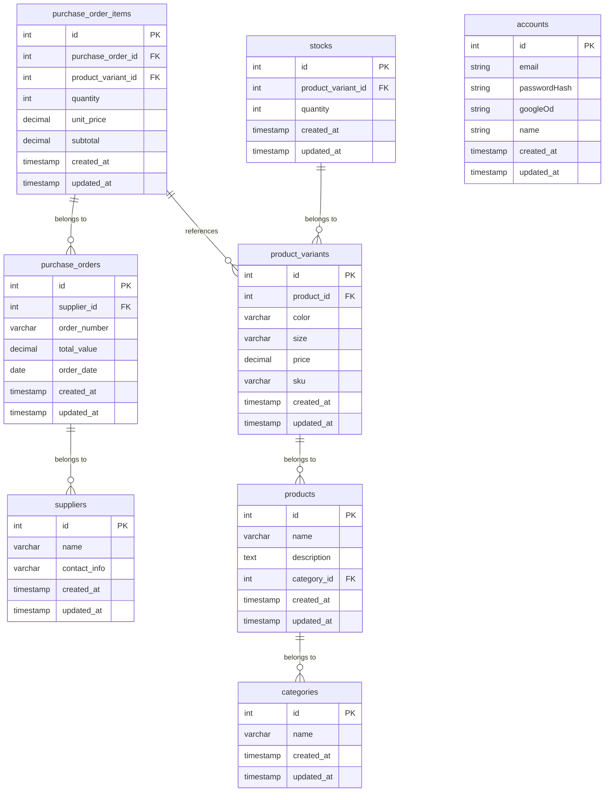

```mermaid

erDiagram

  suppliers {
    int id PK
    varchar name
    varchar contact_info
    timestamp created_at
    timestamp updated_at
  }

  categories {
    int id PK
    varchar name
    timestamp created_at
    timestamp updated_at
  }

  products {
    int id PK
    varchar name
    text description
    int category_id FK
    timestamp created_at
    timestamp updated_at
  }

  product_variants {
    int id PK
    int product_id FK
    varchar color
    varchar size
    decimal price
    varchar sku
    timestamp created_at
    timestamp updated_at
  }

  stocks {
    int id PK
    int product_variant_id FK
    int quantity
    timestamp created_at
    timestamp updated_at
  }

  purchase_orders {
    int id PK
    int supplier_id FK
    varchar order_number
    decimal total_value
    date order_date
    timestamp created_at
    timestamp updated_at
  }

  purchase_order_items {
    int id PK
    int purchase_order_id FK
    int product_variant_id FK
    int quantity
    decimal unit_price
    decimal subtotal
    timestamp created_at
    timestamp updated_at
  }

  accounts {
    int id PK
    string email
    string passwordHash
    string googleOd
    string name
    timestamp created_at
    timestamp updated_at
  }

  products ||--o{ categories : "belongs to"
  product_variants ||--o{ products : "belongs to"
  stocks ||--o{ product_variants : "belongs to"
  purchase_orders ||--o{ suppliers : "belongs to"
  purchase_order_items ||--o{ purchase_orders : "belongs to"
  purchase_order_items ||--o{ product_variants : "references"
```